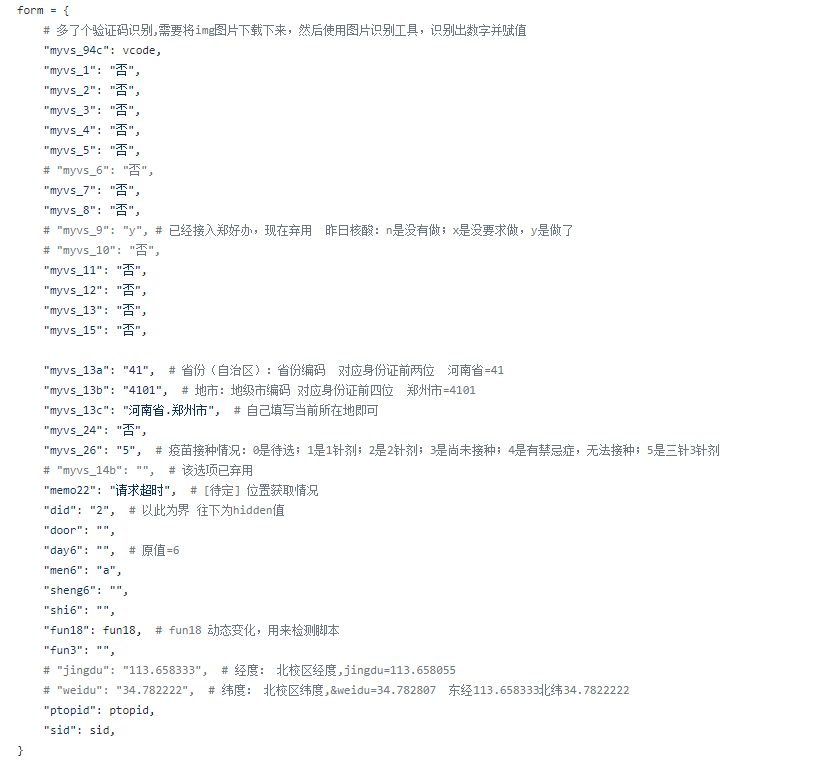
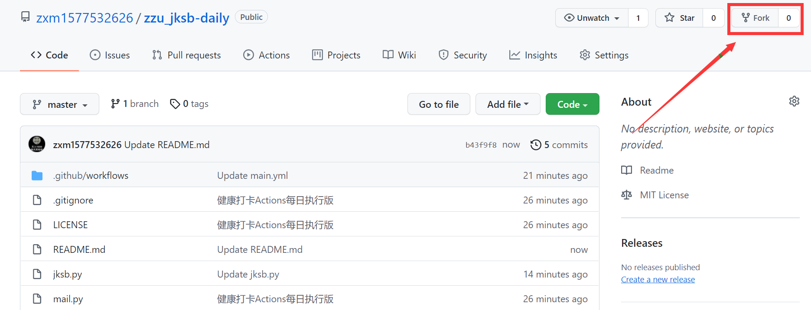
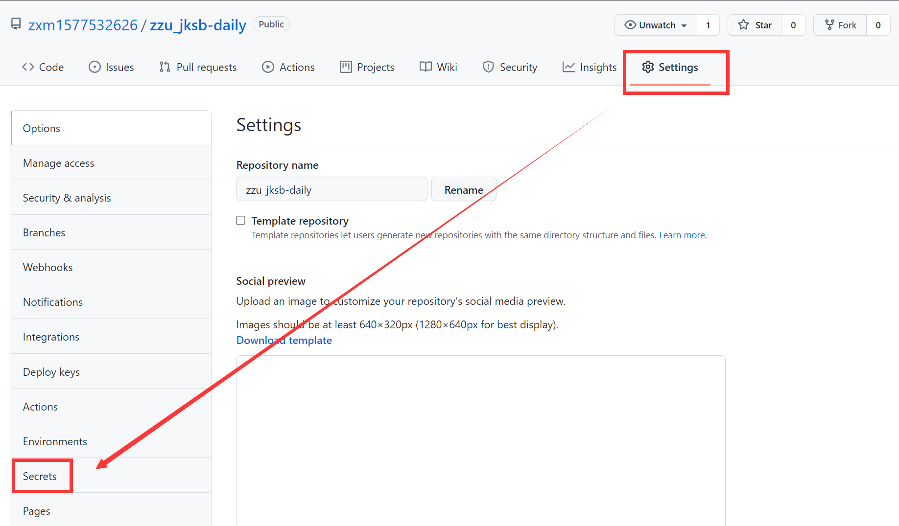
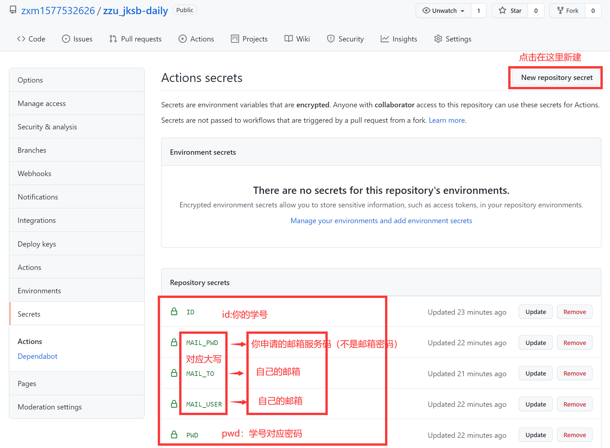
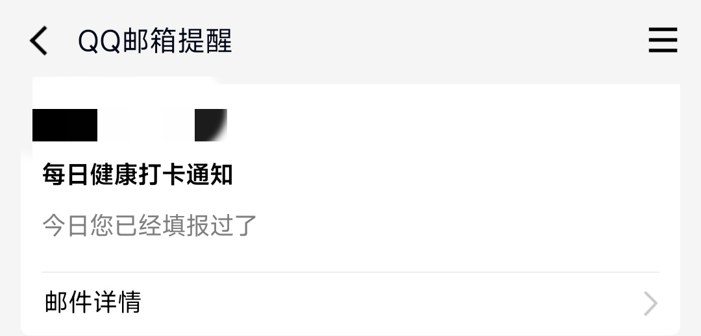
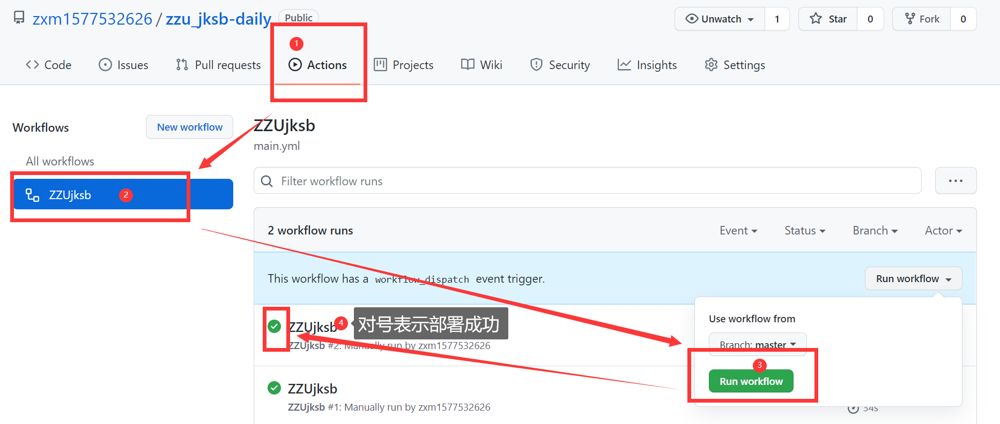

# 《免责声明》
* 本脚本只适用于在校同学学习交流使用！
* 为了每一位学习此脚本同学的权利、义务、责任得到明确，
* 请各位同学仔细阅读本协议内容，此脚本仅用于学习交流使用，不可用作其他用途，如出现私用于其他用途产生任何不良后果者，一切后果由使用者（该同学本人）承担。
* 通过阅读此协议，使用者对本协议所有条款的含义及相关法律后果已全部通晓并充分理解。
* 凡学习使用此脚本者均视为认同并自愿遵守本协议内容。

## ZZU健康上报-恢复打卡
### 如果得到帮助，也不要吝啬点一个Star哟~
该脚本主要用于 郑州地区 由于零点服务器压力较大，现改为04点18分左右自动打卡 郑州大学健康状况上报平台。
* 源代码daka.py表单form中重要数据也已做出注解（见下图），其他地区同学有需求自行更改。

* 如果遇到问题，请及时删除已fork过的仓库，并fork最新仓库。如还有问题，请Issues提问

## 有什么特点？
极其轻量化，直接run--main.py**一站式服务**  
**拿来主义**，根本不用本地化。（有同学想本地学习，随意即可）  
直接在GitHub上就能**轻松部署**  
’懒人式‘一次部署，60天无忧打卡（**原因：项目启用后60天无更新时，Actions功能会自动关闭，需要再次手动部署**）  
不但方便快捷，最重要的是**个人信息安全有了保障**

## 环境依赖
+ `python>=3.8`
+ 详见`requirements.txt`

## 设置
本项目使用GitHub提供的Actions进行定时打卡，这样**自己就不需要服务器了，直接白嫖GitHub的”服务器“多香啊！！！** 
项目已测试成功，能通过Actions直接定时每天打卡，香的一批 
最关键的是，GitHub支持了对**账号、密码等信息的封装**，这样可以**保护使用者的信息安全，防止信息外泄。** 

## 用法：
### 不多说，直接上图！  这里十分感谢每位小伙伴，百忙之中点点fork旁的star！  
### 如果遇到问题，请及时删除已fork过的仓库，并fork最新仓库 （具体见最后更新方法）。如还有问题，请Issues提问

### 1. Fork 仓库
* 点击页面右上角的`Fork`按钮，将本项目保存到自己的仓库。点击`Fork`右侧的`Star`键可以表示您对本项目和作者的认同。
  
### 2. 添加 secrets
* 点击`Settings`-->`Secrets`-->`New repository secret`，进入新建页面。
  
* 在`Name`栏输入`id`，`Value`栏输入自己的学号，然后点击`Add secret`。
* 再次点击`New repository secret`，进入新建页面。
* 在`Name`栏输入`pwd`，`Value`栏输入自己学号的登录密码，然后点击`Add secret`。  
### 如果不需要邮件提醒，可以不配置，同时将main.py中对应代码注释即可
### 建议配置邮件提醒！
* 再次点击`New repository secret`，进入新建页面。
* 在`Name`栏输入`MAIL_USER`，`Value`栏输入自己的邮箱账号 **QQ邮箱**，然后点击`Add secret`。
* 再次点击`New repository secret`，进入新建页面。
* 在`Name`栏输入`MAIL_PWD`，`Value`栏输入**自己邮箱申请的授权码。注意！！！这里不是邮箱的密码** ，然后点击`Add secret`。  
* qq邮箱授权码申请，详细请查看链接qq邮箱官方说明（https://service.mail.qq.com/cgi-bin/help?subtype=1&&no=1001256&&id=28）  
* 再次点击`New repository secret`，进入新建页面。
* 在`Name`栏输入`MAIL_TO`，`Value`栏输入自己的邮箱账号，然后点击`Add secret`。
* 暂不支持多人模式  
### 3.启用 Actions
* 点击上方的`Actions`，点击确认启用`Actions`功能。
* 点击左侧`ZZU COMMUTE HELPER`，点击`Run workflow`，运行一次项目。静静等待QQ邮件通知，一般两分钟左右QQ邮箱就收到了。
  
* 不管你今天是否已经手动打卡，脚本执行后就会收到以下提示：
  

项目部署完毕后，可以在`Actions`页面点击`View workflow file`查看结果。
  
如有疑问可通过`Issues`功能提交问题，如出现签到失败的问题请耐心等待更新。

---
## 📢更新方法--方案3最简单，但需要已经fork最新仓库（后续更新建议方案3）
* 方案1：点击`Settings`-->`Options`-->`Dangerous Zone`-->`delete this reposity`，按照提示删除本项目，**然后重新部署（）重复上述步骤。**
* 方案2：使用git，相关命令请自行搜索。
* 方案3：上边方法稍显复杂，第一次fork后，后续更新也可将所有py文件进行粘贴覆盖，也可完成更新（如有异常，请重复方案1）
