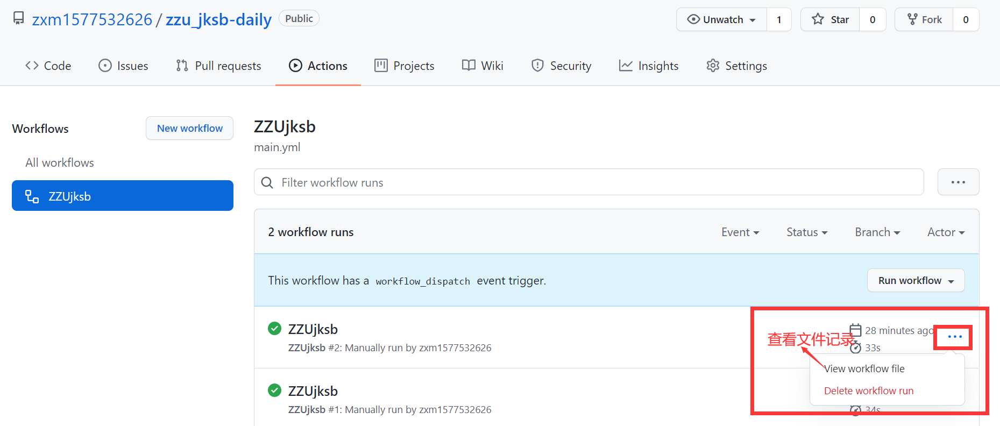

# 郑州大学健康上报脚本
该脚本仅用于 郑州地区 自动打卡郑州大学健康状况上报平台。
* 其他地区请自行修改源代码

## 有什么特点？
极其轻量化，仅有一个py文件--jksb.py**一站式服务**  
**拿来主义**，根本不用本地化。（有同学想本地学习，随意即可）  
直接在GitHub上就能**轻松部署**  
’懒人式‘一次部署，60天无忧打卡（**原因：项目启用后60天无更新时，Actions功能会自动关闭，需要再次手动部署**）  
不但方便快捷，最重要的是**个人信息安全有了保障**

## 环境依赖
+ `python==3.7`
+ 用于发送http请求的`requests`模块

## 设置
本项目使用GitHub提供的Actions进行定时打卡，这样**自己就不需要服务器了，直接白嫖GitHub的”服务器“多香啊！！！** 
项目已测试成功，能通过Actions直接定时每天打卡，香的一批 
最关键的是，GitHub支持了对**账号、密码等信息的封装**，这样可以**保护使用者的信息安全，防止信息外泄。** 

## 用法：
### 不多说，直接上图！    

### 1. Fork 仓库
* 点击页面右上角的`Fork`按钮，将本项目保存到自己的仓库。点击`Fork`左侧的`Star`键可以表示您对本项目和作者的认同。
  
### 2. 添加 secrets
* 点击`Settings`-->`Secrets`-->`New repository secret`，进入新建页面。
  
* 在`Name`栏输入`id`，`Value`栏输入自己的学号，然后点击`Add secret`。
* 再次点击`New repository secret`，进入新建页面。
* 在`Name`栏输入`pwd`，`Value`栏输入自己学号的登录密码，然后点击`Add secret`。  
* 再次点击`New repository secret`，进入新建页面。
* 在`Name`栏输入`MAIL_USER`，`Value`栏输入自己的邮箱账号 **QQ邮箱**，然后点击`Add secret`。
* 再次点击`New repository secret`，进入新建页面。
* 在`Name`栏输入`MAIL_PWD`，`Value`栏输入**自己邮箱申请的授权码。注意！！！这里不是邮箱的密码** ，然后点击`Add secret`。  
* qq邮箱授权码申请，详细请查看链接qq邮箱官方说明（https://service.mail.qq.com/cgi-bin/help?subtype=1&&no=1001256&&id=28）  
* 再次点击`New repository secret`，进入新建页面。
* 在`Name`栏输入`MAIL_TO`，`Value`栏输入自己的邮箱账号，然后点击`Add secret`。
* 暂不支持多人模式  
### 3.启用 Actions
* 点击上方的`Actions`，点击确认启用`Actions`功能。
* 点击左侧`ZZU COMMUTE HELPER`，点击`Run workflow`，运行一次项目。静静等待QQ邮件通知，一般两分钟左右QQ邮箱就收到了。
  
* 如果今天还未打卡，就会收到以下提示：
  
* 如果今天已经打卡，也会收到以下提示：
  

项目部署完毕后，可以在`Actions`页面点击`View workflow file`查看结果。
  
如有疑问可通过`Issues`功能提交问题，如出现签到失败的问题请耐心等待更新。

---
## 📢更新方法
* 点击`Settings`-->`Options`-->`Dangerous Zone`-->`delete this reposity`，按照提示删除本项目，**然后重新部署（）重复上述步骤。**
* 使用git，相关命令请自行搜索。
